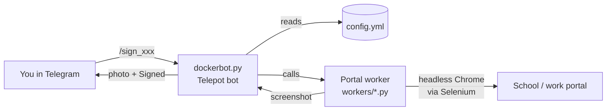

*Please :star: this repo if you find it useful*

<p align="left"><br>
<!-- TODO: badge image URL is dead (404) -->
<a href="https://www.paypal.com/paypalme/techblogil?locale.x=he_IL" target="_blank"></a>
</p>


# Botvid-19

Botvid-19 is an easy-to-use Telegram bot, powered by [Telepot](https://telepot.readthedocs.io/en/latest/) and [Selenium](https://www.selenium.dev/), for signing COVID-19 digital health statements.
It was built for Israeli parents (and Amdocs employees) who had to fill in a daily health declaration on
school and workplace portals: send the bot a command, and it logs in to the portal with a headless Chrome
browser, signs the statement, and sends you back a screenshot of the result.

<!-- TODO: verify - the daily COVID-19 health statement requirement ended, and these portals and forms have probably changed or been removed since the bot was written (2020-2021). The automation is likely obsolete. -->


## Credits

- [Adam Russak](https://github.com/AdamRussak) for working with me on this project and writing the Selenium part

## Table of Contents

- [Features](#features)
- [Supported Platforms](#supported-platforms)
- [How It Works](#how-it-works)
- [Requirements](#requirements)
- [Installation](#installation)
- [Configuration](#configuration)
- [Usage](#usage)
- [Security Notes](#security-notes)
- [Troubleshooting](#troubleshooting)
- [Development](#development)
- [Contributing](#contributing)
- [License](#license)
- [Donation](#donation)

## Features

- Signs the COVID-19 health statement on five portals (see [Supported Platforms](#supported-platforms)).
- One Telegram command per portal; the bot replies with a screenshot of the portal page after the attempt (check it: "Signed" does not guarantee the form was submitted, see [Troubleshooting](#troubleshooting)).
- Mashov supports several children: each `kidN` block in the config is signed in turn.
- `/start` (or `/?`) lists only the commands for the portals you have configured.
- Access control: only the Telegram chat IDs listed in `ALLOWED_IDS` can use the bot; anyone else gets a "No Trespassing" image.
- A default `config.yml` is created in the mounted config folder on first run, and restored if it is deleted.
- Runs as a single Docker container with headless Google Chrome and ChromeDriver.

## Supported Platforms

| Portal | Command | What is signed |
|--------|---------|----------------|
| [edu](https://parents.education.gov.il) (Ministry of Education parents portal) | `/sign_edu` or `/sign` | Kindergarten health statement, logging in with Ministry of Education credentials |
| [Mashov](https://web.mashov.info/students/login) | `/sign_mashov` | Daily COVID-19 report for each configured child |
| [InfoGan](https://campaign.infogan.co.il/) | `/sign_infogan` | Health declaration form at the URL you configure |
| [Webtop](https://www.webtop.co.il/mobilev2/?) | `/sign_webtop` | COVID-19 statement, logging in through Ministry of Education authentication |
| Amdocs (internal ServiceNow portal) | `/sign_amdocs` | Employee health declaration, logging in with Microsoft / ADFS credentials |

## How It Works



1. `supervisord` starts `dockerbot.py`, which listens for Telegram messages with the token in `API_KEY`.
2. Messages from chat IDs that are not in `ALLOWED_IDS` are rejected.
3. For a sign command, the bot loads the matching worker from `workers/`, which opens the portal in headless Chrome, logs in with the credentials from `config.yml`, and submits the statement.
4. The worker saves a screenshot to `/opt/dockerbot/images`, and the bot sends it back to you.

## Requirements

- Docker (and Docker Compose, if you use the compose file).
- A Telegram bot token. If you do not have a bot yet, create one as described in [Bots: An introduction for developers](https://core.telegram.org/bots).
- Your Telegram chat ID. Use [@myidbot](https://t.me/myidbot) in Telegram and send the `/getid` command; the result is your ID.
- Credentials for the portals you want to sign.

## Installation

The published image is [`techblog/botvid-19`](https://hub.docker.com/r/techblog/botvid-19) on Docker Hub (`linux/amd64`).

<!-- TODO: verify - the Docker Hub image was last pushed in January 2021 and is older than the current source (it has no `:1.1.0` tag). -->

### Docker Compose (from Docker Hub)

```yaml
version: "3.7"

services:
  botvid:
    image: techblog/botvid-19
    container_name: botvid
    restart: always
    labels:
      - "com.ouroboros.enable=true"
    environment:
      - API_KEY=
      - ALLOWED_IDS=
    volumes:
      - ./botvid/config/:/opt/dockerbot/config

```

Replace `API_KEY` with your bot token, and set `ALLOWED_IDS` to your chat ID (see [Configuration](#configuration)).

Run:

```bash
docker compose up -d
```

A config file will be created in `./botvid/config/config.yml`. Fill in the parameters for the portals you use (see below), then restart the container so the bot reloads it:

```bash
docker compose restart botvid
```

The `com.ouroboros.enable=true` label is optional; it lets [Ouroboros](https://github.com/pyouroboros/ouroboros) update the container automatically. Ouroboros is no longer maintained.

### Build from source

```bash
git clone https://github.com/t0mer/Botvid-19.git
cd Botvid-19
docker build -t botvid-19 .
```

Then use `image: botvid-19` in the compose file above. The `arm/` folder contains an older, separate Dockerfile for 32-bit ARM (Chromium with an Electron ChromeDriver build); it is not built by CI.

<!-- TODO: verify - the Dockerfile pins ChromeDriver 86 but installs the current google-chrome-stable, and installs the latest Selenium, which no longer has the `find_element_by_xpath` / `executable_path` APIs the code uses. A fresh build is unlikely to work without code changes. -->

## Configuration

### Environment variables

| Variable | Required | Default | Description |
|----------|----------|---------|-------------|
| `API_KEY` | Yes | empty | Telegram bot token. |
| `ALLOWED_IDS` | Yes | none | Comma-separated Telegram chat IDs that may use the bot. The bot cannot handle messages if it is not set. See [Security Notes](#security-notes) for a known weakness in this check. |

### Volume

| Container path | Description |
|----------------|-------------|
| `/opt/dockerbot/config` | Holds `config.yml`. A default file is copied here on first start, and restored within about 10 seconds if it is deleted. You must bind-mount this path. The image also declares `VOLUME /opt/config`, but the code does not use it. |

### `config.yml`

The config file is read once, when the bot starts. You only need to fill in the sections that are relevant to you. Keep every section and key, and leave the values blank for the portals you do not use: a section with no keys (or a missing section or `kid1` block) makes the bot crash at startup or on `/start`, despite what the comment in the template says.

```yaml
edu:
    USER_ID: 
    USER_KEY: 
mashov:
#Add Kids Block as needed
#UNused Kid Block should be left empty or removed from file
    kid1:
        MASHOV_USER_ID_KID: 
        MASHOV_USER_PWD_KID: 
        MASHOV_SCHOOL_ID_KID: 
    kid2:
        MASHOV_USER_ID_KID:
        MASHOV_USER_PWD_KID: 
        MASHOV_SCHOOL_ID_KID:
infogan:
    BASE_URL: 
    PARENT_NAME: 
    PARENT_ID: 
    KID_NAME: 
    KID_ID: 
webtop:
    USER_ID: 
    USER_KEY: 
amdocs:
    EMAIL:
    USER_ID:
    PASSWORD:
```

| Section | Key | Description |
|---------|-----|-------------|
| `edu` | `USER_ID` | Ministry of Education user ID (ID number). |
| `edu` | `USER_KEY` | Ministry of Education password. |
| `mashov.kidN` | `MASHOV_USER_ID_KID` | Mashov username of child *N*. |
| `mashov.kidN` | `MASHOV_USER_PWD_KID` | Mashov password of child *N*. |
| `mashov.kidN` | `MASHOV_SCHOOL_ID_KID` | School number (semel mosad), used to pick the school on the login page. |
| `infogan` | `BASE_URL` | URL of your InfoGan health declaration form. |
| `infogan` | `PARENT_NAME` | Parent's full name. |
| `infogan` | `PARENT_ID` | Parent's ID number. |
| `infogan` | `KID_NAME` | Child's full name. |
| `infogan` | `KID_ID` | Child's ID number. |
| `webtop` | `USER_ID` | Ministry of Education user ID, used to log in to Webtop. |
| `webtop` | `USER_KEY` | Ministry of Education password. |
| `amdocs` | `EMAIL` | Amdocs email address (Microsoft sign-in page). |
| `amdocs` | `USER_ID` | Amdocs network user name (sent as `ntnet\<USER_ID>`). |
| `amdocs` | `PASSWORD` | Amdocs network password. |

Mashov children must be numbered `kid1`, `kid2`, `kid3`, … with no gaps, and `kid1` must be filled in for Mashov to be enabled.

## Usage

Open the bot in Telegram and run the relevant command:

| Command | Description |
|---------|-------------|
| `/?` or `/start` | Show the commands for the portals that are configured. |
| `/sign` or `/sign_edu` | Sign on the Ministry of Education parents portal (edu only). |
| `/sign_mashov` | Sign on Mashov for every configured child. |
| `/sign_infogan` | Sign the InfoGan form. |
| `/sign_webtop` | Sign on Webtop. |
| `/sign_amdocs` | Sign the Amdocs health declaration. |

You will get the signed form after about 10 seconds.

[](https://raw.githubusercontent.com/t0mer/Botvid-19/master/example/images/Botvid-19.png "Telegram Bot Integration")

## Security Notes

- Portal passwords are stored in plain text in `config.yml`. Protect the config folder and do not commit it anywhere.
- Always set `ALLOWED_IDS`, so only your own chat IDs can trigger sign-ins with your credentials. Known weakness: the check is a substring test on the raw `ALLOWED_IDS` text, so any chat ID whose digits appear inside the value passes (for example, `12345678` is accepted when `123456789` is allowed).
- Before opening a portal, each worker loads `https://bots.techblog.co.il/edu.html` (edu worker) or `https://bots.techblog.co.il/infogan.html` (all other workers) as a full page load in the same headless browser (a usage ping). Your portal credentials are not part of that request.
- The bot only makes outgoing connections (Telegram API and the portals); it does not expose any port.

## Troubleshooting

- **"Well, Somthing went wrong, please check the logs for more info"** or `ERROR: ...` in Telegram: the worker failed, usually because the portal page changed or the login failed. Check the container logs with `docker logs botvid`.
- **"xxx NOT configured"**: the matching section in `config.yml` is empty. Fill it in and restart the container, since the config is only read at startup.
- **The bot answers with a "No Trespassing" image**: your chat ID is not in `ALLOWED_IDS`.
- **"Signed" does not guarantee anything was signed**: `/sign_mashov` ignores the worker result, and the edu and Webtop workers report success when the sign button is missing or disabled. Always check the returned screenshot and the container logs.
- **The bot crashes at startup or on `/start`**: a section or key is missing from `config.yml`. Restore the full template and leave unused values blank.

## Development

Project layout:

```
dockerbot.py          # Telegram bot: commands, access control, config loading
helpers.py            # Chrome/Selenium setup, screenshots, logging
workers/              # One Selenium worker per portal
  Health_Statements.py            # edu
  Mashov_Health_Statements.py
  Infogan_Health_Statements.py
  Webtop_Health_Statements.py
  Amdocs_Health_Statements.py
config.yml            # Default config template
supervisord.conf      # Runs dockerbot.py in the container
Dockerfile            # amd64 image (Chrome + ChromeDriver)
arm/                  # Legacy ARM Dockerfile and helpers
```

The paths in the code (`/opt/dockerbot/...`, the ChromeDriver path) assume the Docker image layout, so build and run the bot with Docker.

CI:
- `.github/workflows/docker.yml` builds and pushes `techblog/botvid-19:latest` and `techblog/botvid-19:<VERSION>` when a GitHub release is published.
- `.github/workflows/publish-ghcr.yml` is a manual workflow that pushes `ghcr.io/t0mer/botvid-19`.

## Contributing

Issues and pull requests are welcome. For a new portal, add a worker in `workers/`, a section in `config.yml`, a command in `dockerbot.py`, and a `COPY` line in the `Dockerfile`.

## License

This project is licensed under the [Apache License 2.0](License).

## Donation
<br>
If you find this project helpful, you can give me a cup of coffee :) 

[](https://www.paypal.com/cgi-bin/webscr?cmd=_s-xclick&hosted_button_id=8CGLEHN2NDXDE)
